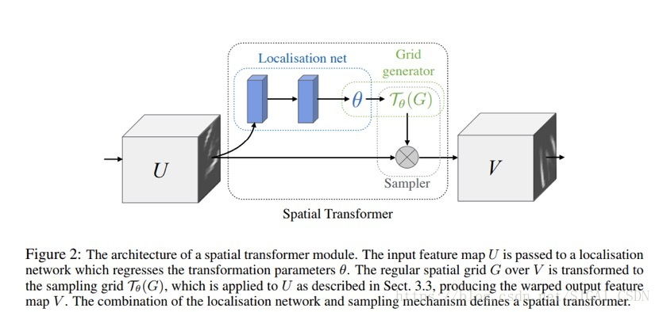

# 基本概念
@(Deep-Learning)[detection]

### 深度学习与传统机器学习的区别与联系

深度学习相比较传统机器学习，解决了一个关键问题：数据的抽象表示问题
https://zhuanlan.zhihu.com/p/26769864

### Embedding Layer的作用

https://gshtime.github.io/2018/06/01/tensorflow-embedding-lookup-sparse/

### 卷积神经网络的旋转不变性

> Q1: 卷积神经网络提取图像特征时具有旋转不变性吗？

A1: 其实CNN是具有一定的旋转不变性，其实之所以有旋转不变性是因为maxpooling采样层得来的，当我们正面拍一些照片的时候，也许我们学习得到的一些地方的activation会比较大，当我们略微的转过一点角度之后，由于maxpooling的存在，会使得我们的maxpooling依然在那个地方取到最大值，所以有一定的旋转不变性，但是，对于角度很大的来说，maxpooling可能也会失效，所以需要一定的data augmentation，或者你也可以提高maxpooling的窗口，来提高一定的旋转不变性。

> 拓展：**空间变换器（spatial transformer network）**
> 普通的CNN能够显示的学习平移不变性，以及隐式的学习旋转不变性，但attention model 告诉我们，与其让网络隐式的学习到某种能力，不如为网络设计一个显式的处理模块，专门处理以上的各种变换。因此，DeepMind就设计了Spatial Transformer Layer，简称STL来完成这样的功能。
> 关于平移不变性 ，对于CNN来说，如果移动一张图片中的物体，那应该是不太一样的。假设物体在图像的左上角，我们做卷积，采样都不会改变特征的位置，糟糕的事情在我们把特征平滑后后接入了全连接层，而全连接层本身并不具备平移不变性的特征。但是 CNN 有一个采样层，假设某个物体移动了很小的范围，经过采样后，它的输出可能和没有移动的时候是一样的，这是 CNN 可以有小范围的平移不变性 的原因。

一个空间变换器的运作机制可以分为三个部分，如下图所示：1） 本地网络（Localisation Network）；2）网格生成器( Grid Genator)；3）采样器（Sampler）。

- 论文出处：https://arxiv.org/abs/1506.02025
- [Spatial Transformer Network paperblog](https://www.cnblogs.com/liaohuiqiang/p/9226335.html)
-  https://blog.csdn.net/qq_39422642/article/details/78870629
