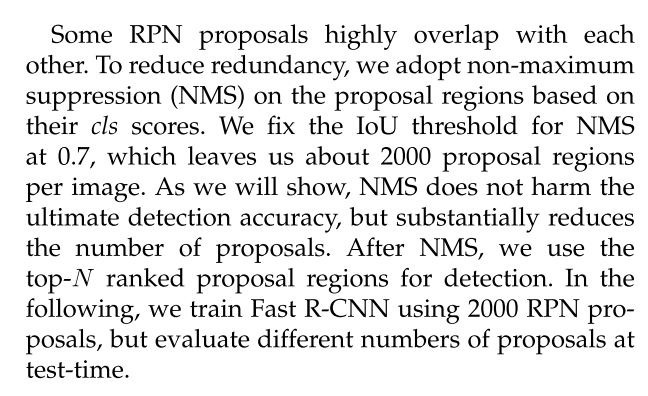
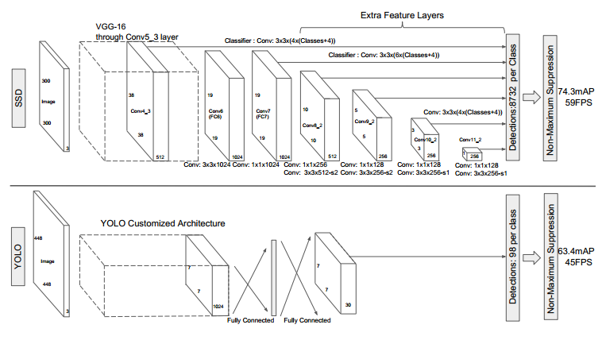

# 物体检测算法

## 基于region proposals的方法（Two-Stage方法）
- RCNN => Fast RCNN => Faster RCNN => FPN 
- https://www.cnblogs.com/liaohuiqiang/p/9740382.html

### faster RCNN

## One-stage方法

### SSD原理与实现

https://blog.csdn.net/u010712012/article/details/86555814
https://github.com/amdegroot/ssd.pytorch
http://www.cs.unc.edu/~wliu/papers/ssd_eccv2016_slide.pdf

## CornerNet  人体姿态检测

- paper出处：https://arxiv.org/abs/1808.01244
- https://zhuanlan.zhihu.com/p/46505759

## NMS优化的必要性research

### R-CNN

$rcnn$主要作用就是用于物体检测，就是首先通过$selective search $选择$2000$个候选区域，这些区域中有我们需要的所对应的物体的bounding-box，然后对于每一个region proposal 都wrap到固定的大小的scale, $227\times227$(AlexNet Input),对于每一个处理之后的图片，把他都放到CNN上去进行特征提取，得到每个region proposal的feature map,这些特征用固定长度的特征集合feature vector来表示。
       最后对于每一个类别，我们都会得到很多的feature vector，然后把这些特征向量直接放到svm现行分类器去判断，当前region所对应的实物是background还是所对应的物体类别，每个region 都会给出所对应的score，因为有些时候并不是说这些region中所包含的实物就一点都不存在，有些包含的多有些包含的少，**包含的多少还需要合适的bounding-box，所以我们才会对于每一region给出包含实物类别多少的分数，选出前几个对大数值，然后再用非极大值抑制canny来进行边缘检测，最后就会得到所对应的bounding-box.**

### SPPNet

如果对selective search(ss)提供的2000多个候选区域都逐一进行卷积处理，势必会耗费大量的时间，所以他觉得，能不能我们先对一整张图进行卷积得到特征图，然后再将ss算法提供的2000多个候选区域的位置记录下来，通过比例映射到整张图的feature map上提取出候选区域的特征图B,然后将B送入到金字塔池化层中，进行权重计算.

然后经过尝试，这种方法是可行的，于是在RCNN基础上，进行了这两个优化得到了这个新的网络sppnet.

####  Faster RCNN

NMS算法，非极大值抑制算法，引入NMS算法的目的在于：根据事先提供的 score 向量，以及 regions（由不同的 bounding boxes，矩形窗口左上和右下点的坐标构成） 的坐标信息，从中筛选出置信度较高的 bounding boxes。

Faster RCNN中输入s=600时，采用了三个尺度的anchor进行推荐，分别时128,256和512，其中推荐的框的个数为$1106786$，需要将这$1100k$的推荐框合并为$2k$个。这个过程其实正是$RPN$神经网络模型。

### SSD

https://blog.csdn.net/wfei101/article/details/78176322
SSD算法中是分为default box(下图中(b)中为default box示意图)和prior box(实际推荐的框)

### 注意

在图像处理领域，几点经验：
1. 输入的图像越大，结果越准确，但是计算量也更多
2. 推荐的框越多，定位准确的概率更高，但是计算量也是会增多
3. 推荐的框往往远大于最终的定位的个数

### 附录
1. [NMS的解释](https://www.cnblogs.com/makefile/p/nms.html)
2. [附录中ROI的解释](http://www.cnblogs.com/rocbomb/p/4428946.html)
3. [SSD算法](https://blog.csdn.net/u013989576/article/details/73439202/)
