# 物体检测算法
深度学习让物体检测从实验室走到生活。基于深度学习的物体检测算法分类两大类。一类是像RCNN类似的两stage方法，将
ROI的选择和对ROI的分类score过程。另外一类是类似YOLO将ROI的选择和最终打分实现端到端一步完成。
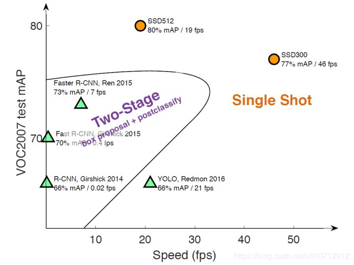

# 基于region proposals的方法（Two-Stage方法）
- RCNN => Fast RCNN => Faster RCNN => FPN 
- https://www.cnblogs.com/liaohuiqiang/p/9740382.html

## faster RCNN
### 整体框架
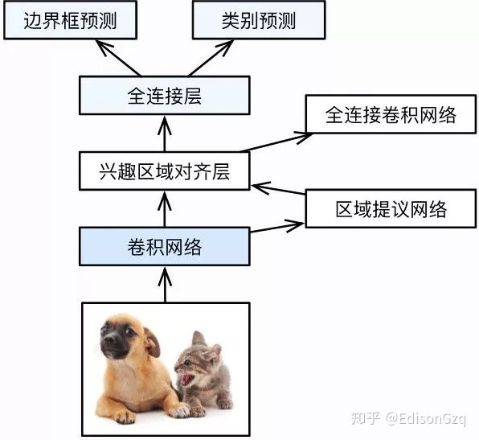
我们先整体的介绍下上图中各层主要的功能

* **卷积网络提取特征图**：

作为一种CNN网络目标检测方法，Faster RCNN首先使用一组基础的conv+relu+pooling层提取input image的feature maps,该feature maps会用于后续的RPN层和全连接层

* **RPN(Region Proposal Networks)**:

RPN网络主要用于生成region proposals，首先生成一堆Anchor box，对其进行裁剪过滤后通过softmax判断anchors属于前景(foreground)或者后景(background)，即是物体or不是物体，所以这是一个二分类；同时，另一分支bounding box regression修正anchor box，形成较精确的proposal（注：这里的较精确是相对于后面全连接层的再一次box regression而言）

* **Roi Pooling**：

该层利用RPN生成的proposals和VGG16最后一层得到的feature map，得到固定大小的proposal feature map,进入到后面可利用全连接操作来进行目标识别和定位

* **Classifier**：

会将ROI Pooling层形成固定大小的feature map进行全连接操作，利用Softmax进行具体类别的分类，同时，利用SmoothL1Loss完成bounding box regression回归操作获得物体的精确位置。

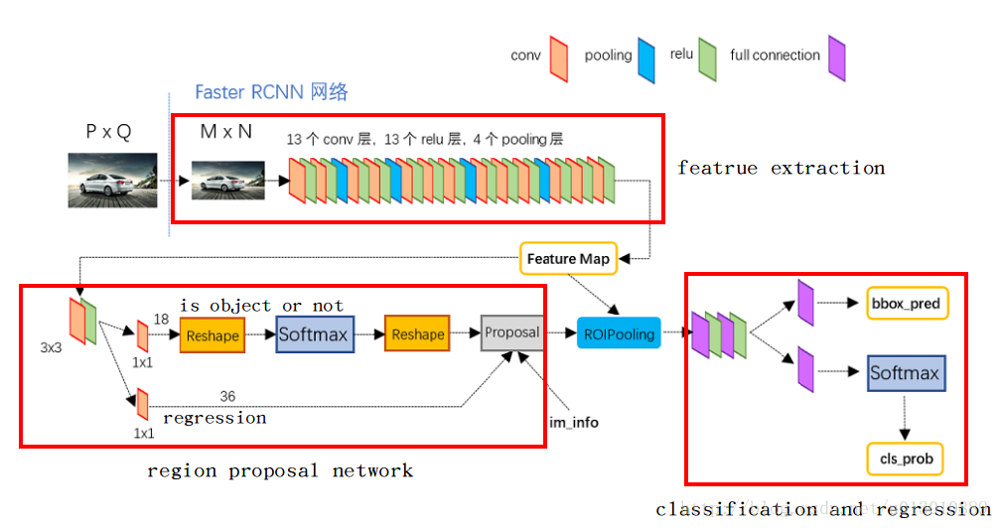

### 参考链接
https://www.cnblogs.com/wangyong/p/8513563.html

## FPN(feature pyramid networks for object detection)
- 论文链接：https://arxiv.org/abs/1612.03144
- poster链接： https://vision.cornell.edu/se3/wp-content/uploads/2017/07/fpn-poster.pdf
- caffe实现: https://github.com/unsky/FPN
- 作者：Tsung-Yi Lin, Piotr Dollár, Ross Girshick, Kaiming He, Bharath Hariharan, Serge Belongie

### 图像金字塔
图像金字塔,在很多的经典算法里面都有它的身影，比如SIFT、HOG等算法。
我们常用的是高斯金字塔，所谓的高斯金字塔是通过高斯平滑和亚采样获得
一些下采样图像，也就是说第K层高斯金字塔通过平滑、亚采样操作就可以
获得K+1层高斯图像，高斯金字塔包含了一系列低通滤波器，其截止频率从
上一层到下一层是以因子2逐渐增加，所以高斯金字塔可以跨越很大的频率范围。
总之，我们输入一张图片，我们可以获得多张不同尺度的图像，我们将这些
不同尺度的图像的4个顶点连接起来，就可以构造出一个类似真实金字塔的一
个图像金字塔。通过这个操作，我们可以为2维图像增加一个尺度维度（或者说是深度），
这样我们可以从中获得更多的有用信息。整个过程类似于人眼看一个目标由远及近的
过程（近大远小原理）。

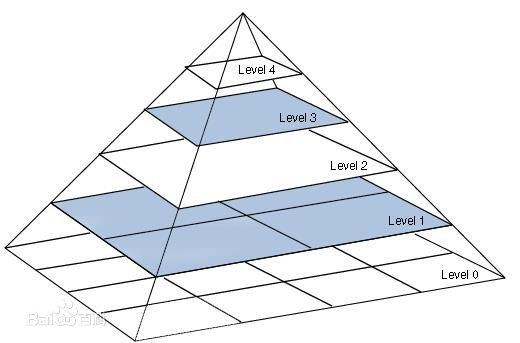

### 论文概述：

作者提出的多尺度的object detection算法：FPN（feature pyramid networks）。原来多数的object detection算法都是只采用顶层特征做预测，但我们知道低层的特征语义信息比较少，但是目标位置准确；高层的特征语义信息比较丰富，但是目标位置比较粗略。另外虽然也有些算法采用多尺度特征融合的方式，但是一般是采用融合后的特征做预测，而本文不一样的地方在于预测是在不同特征层独立进行的。

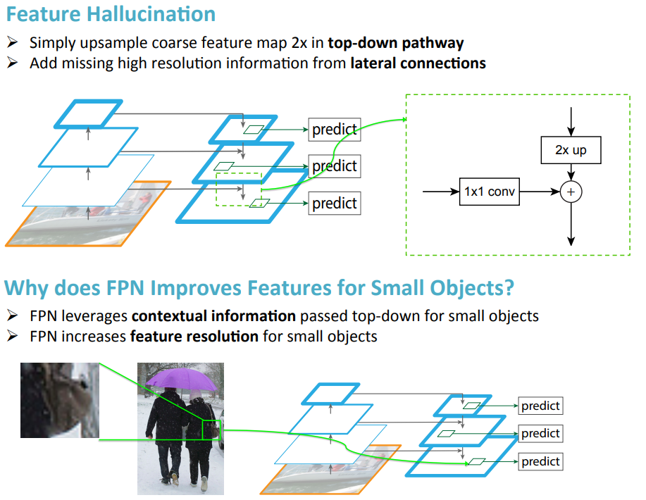

前面已经提到了高斯金字塔，由于它可以在一定程度上面提高算法的性能，
因此很多经典的算法中都包含它。但是这些都是在传统的算法中使用，当然也可以将
这种方法直应用在深度神经网络上面，但是由于它需要大量的运算和大量的内存。
但是我们的特征金字塔可以在速度和准确率之间进行权衡，可以通过它获得更加鲁棒
的语义信息，这是其中的一个原因。

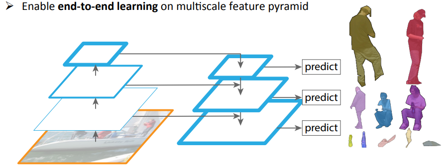

如上图所示，我们可以看到我们的图像中存在不同尺寸的目标，而不同的目标具有不同的特征，
利用浅层的特征就可以将简单的目标的区分开来；
利用深层的特征可以将复杂的目标区分开来；这样我们就需要这样的一个特征金字塔来完成这件事。
图中我们在第1层（请看绿色标注）输出较大目标的实例分割结果，
在第2层输出次大目标的实例检测结果，在第3层输出较小目标的实例分割结果。
检测也是一样，我们会在第1层输出简单的目标，第2层输出较复杂的目标，第3层输出复杂的目标。

### 小结

作者提出的FPN（Feature Pyramid Network）算法同时利用低层特征高分辨率和高层特征的高语义信息，通过融合这些不同层的特征达到预测的效果。并且预测是在每个融合后的特征层上单独进行的，这和常规的特征融合方式不同。 

## Mask-RCNN

# One-stage方法

### SSD原理与实现

https://blog.csdn.net/u010712012/article/details/86555814
https://github.com/amdegroot/ssd.pytorch
http://www.cs.unc.edu/~wliu/papers/ssd_eccv2016_slide.pdf

## CornerNet  人体姿态检测

- paper出处：https://arxiv.org/abs/1808.01244
- https://zhuanlan.zhihu.com/p/46505759

## RPN中的Anchor
Anchor是RPN网络的核心。需要确定每个滑窗中心对应感受野内存在目标与否。由于目标大小和长宽比例不一，需要多个尺度的窗。Anchor即给出一个基准窗大小，按照倍数和长宽比例得到不同大小的窗。有了Anchor之后，才能通过Select Search的方法\Slide Windows方法进行选取ROI的。

首先我们需要知道anchor的本质是什么，本质是SPP(spatial pyramid pooling)思想的逆向。而SPP本身是做什么的呢，就是将不同尺寸的输入resize成为相同尺寸的输出。所以SPP的逆向就是，将相同尺寸的输出，倒推得到不同尺寸的输入。

接下来是anchor的窗口尺寸，这个不难理解，三个面积尺寸（128^2，256^2，512^2），然后在每个面积尺寸下，取三种不同的长宽比例（1:1,1:2,2:1）.这样一来，我们得到了一共9种面积尺寸各异的anchor。示意图如下：
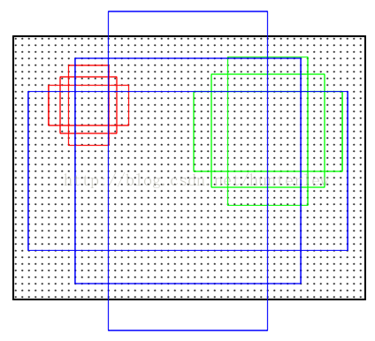
至于这个anchor到底是怎么用的，这个是理解整个问题的关键。

* Faster RCNN
* SSD 
* YOLO
* Guided Anchor: https://arxiv.org/abs/1901.03278


## NMS优化的必要性research

### R-CNN

$rcnn$主要作用就是用于物体检测，就是首先通过$selective search $选择$2000$个候选区域，这些区域中有我们需要的所对应的物体的bounding-box，然后对于每一个region proposal 都wrap到固定的大小的scale, $227\times227$(AlexNet Input),对于每一个处理之后的图片，把他都放到CNN上去进行特征提取，得到每个region proposal的feature map,这些特征用固定长度的特征集合feature vector来表示。
       最后对于每一个类别，我们都会得到很多的feature vector，然后把这些特征向量直接放到svm现行分类器去判断，当前region所对应的实物是background还是所对应的物体类别，每个region 都会给出所对应的score，因为有些时候并不是说这些region中所包含的实物就一点都不存在，有些包含的多有些包含的少，**包含的多少还需要合适的bounding-box，所以我们才会对于每一region给出包含实物类别多少的分数，选出前几个对大数值，然后再用非极大值抑制canny来进行边缘检测，最后就会得到所对应的bounding-box.**

### SPPNet


如果对selective search(ss)提供的2000多个候选区域都逐一进行卷积处理，势必会耗费大量的时间，所以他觉得，能不能我们先对一整张图进行卷积得到特征图，然后再将ss算法提供的2000多个候选区域的位置记录下来，通过比例映射到整张图的feature map上提取出候选区域的特征图B,然后将B送入到金字塔池化层中，进行权重计算.

然后经过尝试，这种方法是可行的，于是在RCNN基础上，进行了这两个优化得到了这个新的网络sppnet.

####  Faster RCNN

NMS算法，非极大值抑制算法，引入NMS算法的目的在于：根据事先提供的 score 向量，以及 regions（由不同的 bounding boxes，矩形窗口左上和右下点的坐标构成） 的坐标信息，从中筛选出置信度较高的 bounding boxes。


Faster RCNN中输入s=600时，采用了三个尺度的anchor进行推荐，分别时128,256和512，其中推荐的框的个数为$1106786$，需要将这$1100k$的推荐框合并为$2k$个。这个过程其实正是$RPN$神经网络模型。

### SSD

https://blog.csdn.net/wfei101/article/details/78176322
SSD算法中是分为default box(下图中(b)中为default box示意图)和prior box(实际推荐的框)
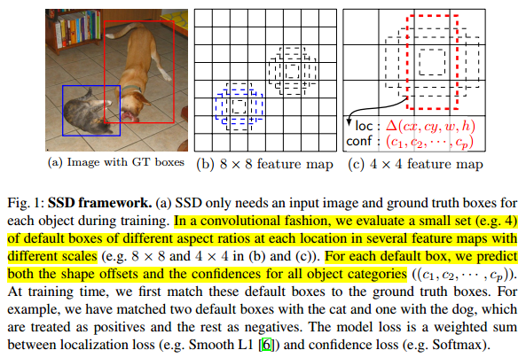


### 注意

在图像处理领域，几点经验：
1. 输入的图像越大，结果越准确，但是计算量也更多
2. 推荐的框越多，定位准确的概率更高，但是计算量也是会增多
3. 推荐的框往往远大于最终的定位的个数


# 目标检测特殊层
## ROIpooling
ROIs Pooling顾名思义，是Pooling层的一种，而且是针对RoIs的Pooling，他的特点是输入特征图尺寸不固定，但是输出特征图尺寸固定；

> ROI是Region of Interest的简写，指的是在“特征图上的框”; 
> * 在Fast RCNN中， RoI是指Selective Search完成后得到的“候选框”在特征图上的映射，如下图中的红色框所示；
> * 在Faster RCNN中，候选框是经过RPN产生的，然后再把各个“候选框”映射到特征图上，得到RoIs。


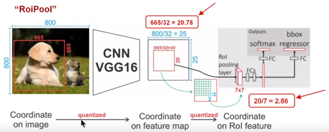

参考faster rcnn中的ROI Pool层，功能是将不同size的ROI区域映射到固定大小的feature map上。

### 缺点：由于两次量化带来的误差；
* 将候选框边界量化为整数点坐标值。
* 将量化后的边界区域平均分割成 k x k 个单元(bin),对每一个单元的边界进行量化。

### 案例说明
下面我们用直观的例子具体分析一下上述区域不匹配问题。如 图1 所示，这是一个Faster-RCNN检测框架。输入一张$800\times 800$的图片，图片上有一个$665\times 665$的包围框(框着一只狗)。图片经过主干网络提取特征后，特征图缩放步长（stride）为32。因此，图像和包围框的边长都是输入时的1/32。800正好可以被32整除变为25。但665除以32以后得到20.78，带有小数，于是ROI Pooling 直接将它量化成20。接下来需要把框内的特征池化$7\times7$的大小，因此将上述包围框平均分割成$7\times7$个矩形区域。显然，每个矩形区域的边长为2.86，又含有小数。于是ROI Pooling 再次把它量化到2。经过这两次量化，候选区域已经出现了较明显的偏差（如图中绿色部分所示）。更重要的是，该层特征图上0.1个像素的偏差，缩放到原图就是3.2个像素。那么0.8的偏差，在原图上就是接近30个像素点的差别，这一差别不容小觑。

[roi_pooling_layer.cpp](https://github.com/ShaoqingRen/caffe/blob/062f2431162165c658a42d717baf8b74918aa18e/src/caffe/layers/roi_pooling_layer.cpp)

```cpp
template <typename Dtype>
void ROIPoolingLayer<Dtype>::Forward_cpu(const vector<Blob<Dtype>*>& bottom,
      const vector<Blob<Dtype>*>& top) {
  //输入有两部分组成，data和rois
  const Dtype* bottom_data = bottom[0]->cpu_data();
  const Dtype* bottom_rois = bottom[1]->cpu_data();
  // ROIs的个数
  int num_rois = bottom[1]->num();
  int batch_size = bottom[0]->num();
  int top_count = top[0]->count();
  Dtype* top_data = top[0]->mutable_cpu_data();
  caffe_set(top_count, Dtype(-FLT_MAX), top_data);
  int* argmax_data = max_idx_.mutable_cpu_data();
  caffe_set(top_count, -1, argmax_data);

  // For each ROI R = [batch_index x1 y1 x2 y2]: max pool over R
  for (int n = 0; n < num_rois; ++n) {
    int roi_batch_ind = bottom_rois[0];
    // 把原图的坐标映射到feature map上面
    int roi_start_w = round(bottom_rois[1] * spatial_scale_);
    int roi_start_h = round(bottom_rois[2] * spatial_scale_);
    int roi_end_w = round(bottom_rois[3] * spatial_scale_);
    int roi_end_h = round(bottom_rois[4] * spatial_scale_);
    // 计算每个roi在feature map上面的大小
    int roi_height = max(roi_end_h - roi_start_h + 1, 1);
    int roi_width = max(roi_end_w - roi_start_w + 1, 1);
    //pooling之后的feature map的一个值对应于pooling之前的feature map上的大小
    //注：由于roi的大小不一致，所以每次都需要计算一次
    const Dtype bin_size_h = static_cast<Dtype>(roi_height)
                             / static_cast<Dtype>(pooled_height_);
    const Dtype bin_size_w = static_cast<Dtype>(roi_width)
                             / static_cast<Dtype>(pooled_width_);
    //找到对应的roi的feature map，如果input data的batch size为1
    //那么roi_batch_ind=0
    const Dtype* batch_data = bottom_data + bottom[0]->offset(roi_batch_ind);
    //pooling的过程是针对每一个channel的，所以需要循环遍历
    for (int c = 0; c < channels_; ++c) {
      //计算output的每一个值，所以需要遍历一遍output，然后求出所有值
      for (int ph = 0; ph < pooled_height_; ++ph) {
        for (int pw = 0; pw < pooled_width_; ++pw) {
          // Compute pooling region for this output unit:
          //  start (included) = floor(ph * roi_height / pooled_height_)
          //  end (excluded) = ceil((ph + 1) * roi_height / pooled_height_)
          // 计算output上的一点对应于input上面区域的大小[hstart, wstart, hend, wend]
          int hstart = static_cast<int>(floor(static_cast<Dtype>(ph)
                                              * bin_size_h));
          int hend = static_cast<int>(ceil(static_cast<Dtype>(ph + 1)
                                           * bin_size_h));
          int wstart = static_cast<int>(floor(static_cast<Dtype>(pw)
                                              * bin_size_w));
          int wend = static_cast<int>(ceil(static_cast<Dtype>(pw + 1)
                                           * bin_size_w));
          //将映射后的区域平动到对应的位置[hstart, wstart, hend, wend]
          hstart = min(max(hstart + roi_start_h, 0), height_);
          hend = min(max(hend + roi_start_h, 0), height_);
          wstart = min(max(wstart + roi_start_w, 0), width_);
          wend = min(max(wend + roi_start_w, 0), width_);
          //如果映射后的矩形框不符合
          bool is_empty = (hend <= hstart) || (wend <= wstart);
          //pool_index指的是此时计算的output的值对应于output的位置
          const int pool_index = ph * pooled_width_ + pw;
          //如果矩形不符合，此处output的值设为0，此处的对应于输入区域的最大值为-1
          if (is_empty) {
            top_data[pool_index] = 0;
            argmax_data[pool_index] = -1;
          }
          //遍历output的值对应于input的区域块
          for (int h = hstart; h < hend; ++h) {
            for (int w = wstart; w < wend; ++w) {
             // 对应于input上的位置
              const int index = h * width_ + w;
              //计算区域块的最大值，保存在output对应的位置上
              //同时记录最大值的索引
              if (batch_data[index] > top_data[pool_index]) {
                top_data[pool_index] = batch_data[index];
                argmax_data[pool_index] = index;
              }
            }
          }
        }
      }
      // Increment all data pointers by one channel
      batch_data += bottom[0]->offset(0, 1);
      top_data += top[0]->offset(0, 1);
      argmax_data += max_idx_.offset(0, 1);
    }
    // Increment ROI data pointer
    bottom_rois += bottom[1]->offset(1);
  }
}
```
## ROI Align
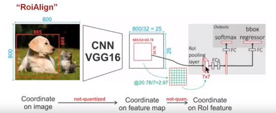

为了解决ROI Pooling的上述缺点，作者提出了ROI Align这一改进的方法。ROI Align的思路很简单：取消量化操作，使用双线性内插的方法获得坐标为浮点数的像素点上的图像数值,从而将整个特征聚集过程转化为一个连续的操作。值得注意的是，在具体的算法操作上，ROI Align并不是简单地补充出候选区域边界上的坐标点，然后将这些坐标点进行池化，而是重新设计了一套比较优雅的流程，如下图所示：
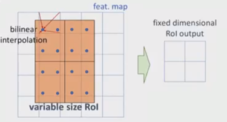
* 遍历每一个候选区域，保持浮点数边界不做量化。
* 将候选区域分割成$k\times k$个单元，每个单元的边界也不做量化。
* 在每个单元中计算固定四个坐标位置，用双线性内插的方法计算出这四个位置的值，然后进行最大池化操作。

这里对上述步骤的第三点作一些说明：这个固定位置是指在每一个矩形单元（bin）中按照固定规则确定的位置。比如，如果采样点数是1，那么就是这个单元的中心点。如果采样点数是4，那么就是把这个单元平均分割成四个小方块以后它们分别的中心点。显然这些采样点的坐标通常是浮点数，所以需要使用插值的方法得到它的像素值。在相关实验中，作者发现将采样点设为4会获得最佳性能，甚至直接设为1在性能上也相差无几。
事实上，ROIAlign在遍历取样点的数量上没有ROIPooling那么多，但却可以获得更好的性能，这主要归功于解决了**misalignment**的问题。值得一提的是，我在实验时发现，ROIAlign在VOC2007数据集上的提升效果并不如在COCO上明显。经过分析，造成这种区别的原因是COCO上小目标的数量更多，而小目标受**misalignment**问题的影响更大（比如，同样是0.5个像素点的偏差，对于较大的目标而言显得微不足道，但是对于小目标，误差的影响就要高很多）。ROIAlign层要将feature map固定为2*2大小，那些蓝色的点即为采样点，然后每个bin中有4个采样点，则这四个采样点经过MAX得到ROI output；

> 通过双线性插值避免了量化操作，保存了原始ROI的空间分布，有效避免了误差的产生；小目标效果比较好


# 物体检测效果评估相关的definitions  
### Intersection Over Union (IOU)
Intersection Over Union (IOU) is measure based on Jaccard Index that evaluates the overlap between two bounding boxes. It requires a ground truth bounding box  $B_{gt}$and a predicted bounding box $B_p$ By applying the IOU we can tell if a detection is valid (True Positive) or not (False Positive).  
IOU is given by the overlapping area between the predicted bounding box and the ground truth bounding box divided by the area of union between them:  
$$IOC = \frac{area of overlap}{area of union} = \frac{area(B_p \cap B_{gt})}{area(B_p \cup B_{gt})}$$

The image below illustrates the IOU between a ground truth bounding box (in green) and a detected bounding box (in red).

<p align="center">
</p>

### True Positive, False Positive, False Negative and True Negative  

Some basic concepts used by the metrics:  

* **True Positive (TP)**: A correct detection. Detection with `IOU ≥ _threshold_`
* **False Positive (FP)**: A wrong detection. Detection with `IOU < _threshold_`
* **False Negative (FN)**: A ground truth not detected
* **True Negative (TN)**: Does not apply. It would represent a corrected misdetection. In the object detection task there are many possible bounding boxes that should not be detected within an image. Thus, TN would be all possible bounding boxes that were corrrectly not detected (so many possible boxes within an image). That's why it is not used by the metrics.

`_threshold_`: depending on the metric, it is usually set to 50%, 75% or 95%.

### Precision

Precision is the ability of a model to identify **only** the relevant objects. It is the percentage of correct positive predictions and is given by:
$$Precision = \frac{TP}{TP + FP} = \frac{TP}{all-detections}$$

### Recall 

Recall is the ability of a model to find all the relevant cases (all ground truth bounding boxes). It is the percentage of true positive detected among all relevant ground truths and is given by:
$$Recall = \frac{TP}{TP + FN} = \frac{TP}{all-groundtruths}$$

# 评估方法Metrics
* Precision x Recall curve
* Average Precision
  * 11-point interpolation
  * Interpolating all points

### 附录
1. [NMS的解释](https://www.cnblogs.com/makefile/p/nms.html)
2. [附录中ROI的解释](http://www.cnblogs.com/rocbomb/p/4428946.html)
3. [SSD算法](https://blog.csdn.net/u013989576/article/details/73439202/)
4. [评估标准](https://github.com/cwlseu/Object-Detection-Metrics)