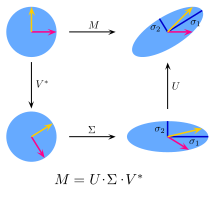

# 数学基础
## 常见中英文对照
| English   | 中文 | 备注  |
| :-------- | --------:| :--: |
| Singular values | 奇异值 |  |
|decomposition| 分解||
|eigenvalue |特征值||
|orthogonal | 正交的 ||

## 协方差
https://www.zhihu.com/question/20852004

## 交叉熵&相对熵
https://zhuanlan.zhihu.com/p/29321631

## SVD分解
- 奇异值分解: https://zhuanlan.zhihu.com/p/31386807
- https://en.wikipedia.org/wiki/Singular_value_decomposition

### SVD常见的应用场景1（Low-rank matrix approximation）
Some practical applications need to solve the problem of approximating a matrix $M$ with another matrix $\hat{M}$, said truncated, which has a specific rank $r$. In the case that the approximation is based on minimizing the Frobenius norm of the difference between $M$ and $\hat{M}$ under the constraint that $rank(\hat{M})=r$
例如在Fast RCNN，使用SVD算法将最终的全连接层进行性能提升。此外，SVD是后来多篇神经网络压缩算法的基础，尤其是像全连接层这种，具有超多参数，但是信息密度比较小的权重矩阵。

### SVD常见的应用场景2（Nearest orthogonal matrix）
这个在神经网络压缩中的应用还是蛮多的。其中厦门大学关于神经网络所有全连接层整体进行压缩的工作(Global Error Reconstruction)就是基于应用场景展开的。

### SVD常见的应用场景3（Total least squares minimization）

A total least squares problem refers to determining the vector $x$ which minimizes the 2-norm of a vector $Ax$ under the constraint $||x|| = 1$. The solution turns out to be the right-singular vector of $A$ corresponding to the **smallest singular value**.

### Separable models
在推荐系统中尤其重要
HOG算子的变种FHOG算子

### 参考文献
- [SVD分解维基百科](https://en.wikipedia.org/wiki/Singular_value_decomposition)
- [Fast RCNN paper](https://arxiv.org/abs/1504.08083)
- [FHOG算法]()
- [Holistic CNN Compression via Low-rank Decomposition with Knowledge Transfer源码](https://github.com/cwlseu/LRDKT)
- [Towards Convolutional Neural Networks Compressing via Global Error Reconstruction](http://ijcai-16.org/index.php/welcome/view/accepted_papers)