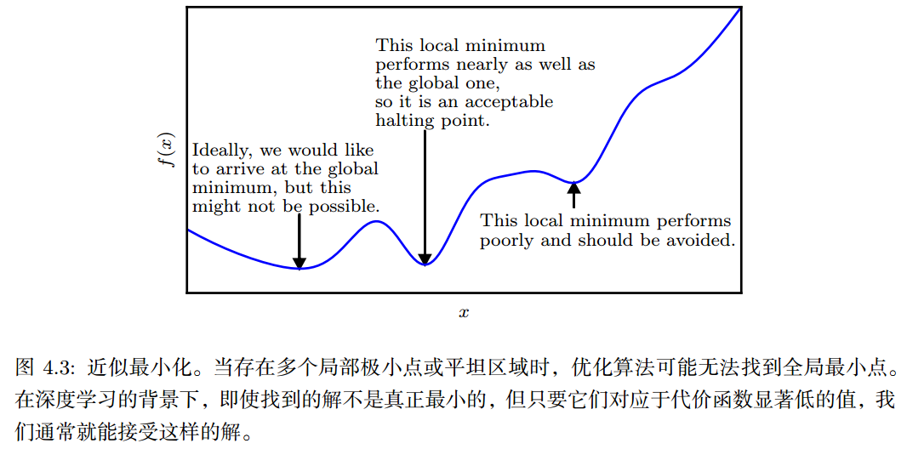

# 数学基础
介绍理解深度学习所需的基本数学概念。我们从应用数学的一般概念开始，这能使我们定义许多变量的函数，
找到这些函数的最高和最低点，并量化信念度。接着，我们描述机器学习的基本目标，并描述如何实现这些目标。
我们需要指定代表某些信念的模型、设计衡量这些信念与现实对应程度的代价函数以及使用训练算法最小化这个代价函数。
这个基本框架是广泛多样的机器学习算法的基础，其中也包括非深度的机器学习方法。

## 常见中英文对照
| English   | 中文 | 备注  |
| :-------- | --------:| :--: |
| Singular values | 奇异值 |  |
|decomposition| 分解||
|eigenvalue |特征值||
|orthogonal | 正交的 ||

## 协方差
https://www.zhihu.com/question/20852004

## 交叉熵&相对熵
https://zhuanlan.zhihu.com/p/29321631

## SVD分解
- 奇异值分解: https://zhuanlan.zhihu.com/p/31386807
- https://en.wikipedia.org/wiki/Singular_value_decomposition

### SVD常见的应用场景1（Low-rank matrix approximation）
Some practical applications need to solve the problem of approximating a matrix $M$ with another matrix $\hat{M}$, said truncated, which has a specific rank $r$. In the case that the approximation is based on minimizing the Frobenius norm of the difference between $M$ and $\hat{M}$ under the constraint that $rank(\hat{M})=r$
例如在Fast RCNN，使用SVD算法将最终的全连接层进行性能提升。此外，SVD是后来多篇神经网络压缩算法的基础，尤其是像全连接层这种，具有超多参数，但是信息密度比较小的权重矩阵。

### SVD常见的应用场景2（Nearest orthogonal matrix）
这个在神经网络压缩中的应用还是蛮多的。其中厦门大学关于神经网络所有全连接层整体进行压缩的工作(Global Error Reconstruction)就是基于应用场景展开的。

### SVD常见的应用场景3（Total least squares minimization）

A total least squares problem refers to determining the vector $x$ which minimizes the 2-norm of a vector $Ax$ under the constraint $||x|| = 1$. The solution turns out to be the right-singular vector of $A$ corresponding to the **smallest singular value**.

### Separable models
在推荐系统中尤其重要
HOG算子的变种FHOG算子

## 范数
### $L^p$范数定义
$$||\mathbf{x}||_p = (\sum_i |x_i|^p)^{\frac{1}{p}} $$
其中$p \in R, p \ge 1$
范数（包括 Lp 范数）是将向量映射到非负值的函数。直观上来说，向量 $\mathbf{x}$的
范数衡量从原点到点$x$的距离。更严格地说，范数是满足下列性质的任意函数：
* $f(x) = 0  \Rightarrow x = 0$
* $f(x + y) \le f(x) + f(y)$ （三角不等式）
* $\forall \alpha \in R, f(\alpha x) = \alpha f(x)$

### 知名范数 
- $L^2$范数被称为欧几里得范数（Euclidean norm）。
平方$L^2$范数在数学和计算上都比L2范数本身更方便。例如，平方$L^2$范数对
x 中每个元素的导数只取决于对应的元素，而$L^2$范数对每个元素的导数却和整个向
量相关。但是在很多情况下，平方$L^2$范数也可能不受欢迎，因为它在原点附近增长
得十分缓慢。

- 在某些机器学习应用中，区分恰好是零的元素和非零但值很小的元素是很重要的。在这些情况下，我们转而使用在各个位置斜率相同，同时保持简单的数学形式的函数：$L^1$范数。
当机器学习问题中零和非零元素之间的差异非常重要时，通常会使用$L^1$范数。

- 有时候我们会统计向量中非零元素的个数来衡量向量的大小。有些作者将这种
函数称为$L^0$ 范数，但是这个术语在数学意义上是不对的。向量的非零元素的数目
不是范数，因为对向量缩放$\alpha$倍不会改变该向量非零元素的数目。因此，$L^1$范数经
常作为表示非零元素数目的替代函数.

- 一个经常在机器学习中出现的范数是$L^\infty$范数，也被称为最大范数（max
norm）。这个范数表示向量中具有最大幅值的元素的绝对值：
$$||\mathbf{x}||_\infty = \max_i|\mathbf{x}_i| $$

- 有时候我们可能也希望衡量矩阵的大小。在深度学习中，最常见的做法是使
用 Frobenius 范数（Frobenius norm），
$$||A||_F = \sqrt{\sum_{i,j}{A_{i,j}^2}}$$

### 深度学习中的应用
参数正则化，提高算法的泛化能力，减少模型参数。
~~我们最终的目的是将训练好的模型部署到真实的环境中，希望训练好的模型能够在真实的数据上得到好的预测效果，~~
~~换句话说就是希望模型在真实数据上预测的结果误差越小越好。我们把模型在真实环境中的误差叫做泛化误差，~~
~~最终的目的是希望训练好的模型泛化误差越低越好。~~

## 概率基础
概率论是用于表示不确定性声明的数学框架。它不仅提供了量化不确定性的方法，也提供了用于导出新的不确定性声明（statement）的公理。
在人工智能领域，概率论主要有两种用途:
* 概率法则告诉我们 AI系统如何推理，据此我们设计一些算法来计算或者估算由概率论导出的表达式。
* 用概率和统计从理论上分析我们提出的 AI 系统的行为。

### 频率概率 v.s. 贝叶斯概率
直接与事件发生的频率相联系，被称为 频率派概率（frequentist probability）；
涉及到确定性水平，被称为贝叶斯概率（Bayesian probability）

概率可以被看作是用于处理不确定性的逻辑扩展。逻辑提供了一套形式化的规则，可以在给定某些命题是真或假的假设下，判断另外一些命题是真的还是假的。
概率论提供了一套形式化的规则，可以在给定一些命题的似然后，计算其他命题为真的似然。

1. 离散型变量和概率质量函数
随机变量（random variable）是可以随机地取不同值的变量。随机变量可以是离散的或者连续的。离散随机变量拥有有限或者可数无限多的状态。
离散型变量的概率分布可以用 概率质量函数（probability mass function, PMF，或者叫概率分布律）来描述。我们通常用大写字母 P 来表示概率质量函数。
概率质量函数可以同时作用于多个随机变量。这种多个变量的概率分布被称为联合概率分布（joint probability distribution）

2. 连续型变量和概率密度函数（probability density function, PDF）

3. 边缘概率分布（marginal probability
distribution）
我们知道了一组变量的联合概率分布，但想要了解其中一个子集的概率分布。这种定义在子集上的概率分布被称为边缘概率分布（marginal probability
distribution）
### 条件概率
#### 链式法则（乘法法则）
$P(x^{(1)},...,x^{(n)}) = P(x^{(1)})\Pi^{n}_{i=2}P(x^{(i)}|x^{(1)},...,x^{(i-1)})$

$$P(a,b,c) = P(a|b,c)P(b,c)$$
$$P(b,c) = P(b|c)P(c)$$
$$P(a,b,c) = P(a|b,c)P(b|c)P(c)$$
## 基于梯度的优化算法

### 梯度下降（一阶最优化算法）

我们把要最小化或最大化的函数$f(x)$称为目标函数（objective function）或准则（criterion）。
当我们对其进行最小化时，我们也把它称为代价函数（cost function）、损失函数（loss function）或误差函数（error function）。
- x往导数的反方向移动一小步来减小$f(x)$。这种技术被称为梯度下降（gradient descent）
- 使 f(x) 取得绝对的最小值（相对所有其他值）的点是全局最小点（global minimum）。函数可能只有一个全局最小点或存在多个全局最小点，还可能存在不是全局最优的局部极小点（local minimum）。

- 虽然梯度下降被限制在连续空间中的优化问题，但不断向更好的情况移动一小步（即近似最佳的小移动）的一般概念可以推广到离散空间。递增带有离散参数的目标函数被称为爬山（hill climbing）算法 

### Jacobian和Hessian矩阵
我们需要计算输入和输出都为向量的函数的所有偏导数。包含所有这样的
偏导数的矩阵被称为Jacobian矩阵。具体来说，如果我们有一个函数：$\mathbf{f} : R^m  \rightarrow R^n$，
$\mathbf{f}$的Jacobian矩阵$J \in R^{n\times m}$定义为 $\mathbf{J}_{i,j} = \frac{\partial}{\partial x_j}f(\mathbf{x})_i$
二阶导数告诉我们，一阶导数将如何随着输入的变化而改变。它表示只基于梯度信息的梯度下降步骤是否会产生如我们预期的那样大的改善，因此它是重要的。
当我们的函数具有多维输入时， 二阶导数也有很多。我们可以将这些导数合并成一个矩阵，称为Hessian矩阵。 
$\mathbf{H}(f)(\mathbf{x})_{i,j} = \frac{\partial^2 }{\partial x_i \partial x_j}f(\mathbf{x})$

### 牛顿法（二阶最优化算法）

## 参考文献
- [SVD分解维基百科](https://en.wikipedia.org/wiki/Singular_value_decomposition)
- [Fast RCNN paper](https://arxiv.org/abs/1504.08083)
- [FHOG算法]()
- [Holistic CNN Compression via Low-rank Decomposition with Knowledge Transfer源码](https://github.com/cwlseu/LRDKT)
- [Towards Convolutional Neural Networks Compressing via Global Error Reconstruction](http://ijcai-16.org/index.php/welcome/view/accepted_papers)